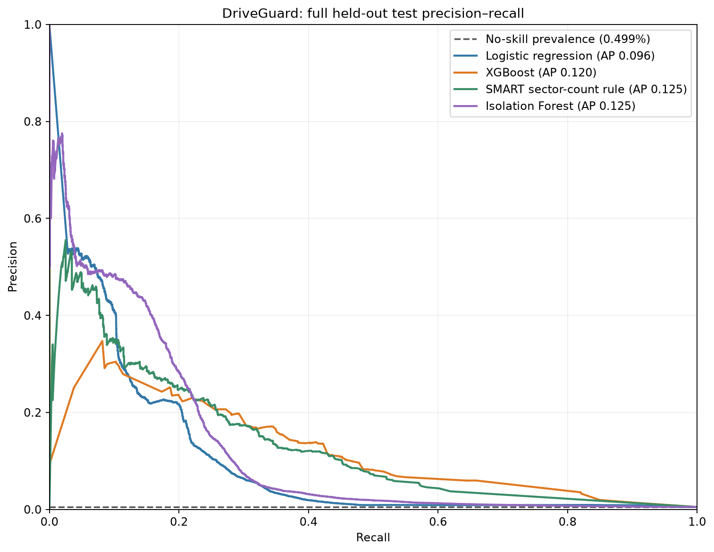
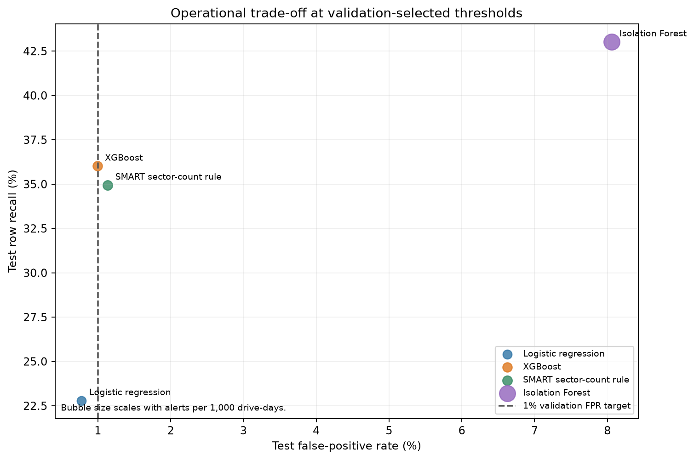

# 🛡️ DriveGuard | a 30-day hard-drive failure early-warning study

**Can daily SMART readings give a useful warning before a drive failure?** DriveGuard turns Backblaze's public drive history into a reproducible rare-event study: censor-aware labels, time-ordered evaluation, model comparisons, error analysis, and an interactive dashboard.

This is a retrospective portfolio project built on **2013 data**. It is not a live monitoring service and its scores should not be used to make equipment-replacement decisions.

<p align="center">
  
</p>

## 📊 The result, in context

The final holdout contains **1,235,875 drive-days**, with **6,164 positive labels** (0.499%). Every row in the test period is retained; its natural class balance is not altered. At the threshold selected on validation, the XGBoost model reached:

| Measure | Held-out result | How to read it |
|---|---:|---|
| Average precision | **0.1198** | About 24× the test positive prevalence (0.0050); a ranking metric for this rare-event task |
| Recall | **36.0%** | Detected 2,220 of 6,164 positive drive-days |
| Precision | **15.4%** | About 1 in 6 flagged drive-days was positive under this label definition |
| False-positive rate | **0.99%** | Close to the 1% validation target on this test period |
| Alert volume | **11.7 / 1,000 drive-days** | Row-level flags; repeated daily flags are not deduplicated into episodes |
| Event coverage | **45.0%** | At least one alert before 45% of eligible failure events |
| Median lead among detected events | **24 days** | Event-level timing, conditional on detection |

Thresholds were selected on validation, not tuned on the test set. The 95% drive-cluster bootstrap intervals are **31.0–41.1% recall** and **12.8–18.0% precision**. They describe drive-sampling variability in this historical test period; they do not capture time dependence or population shift.

### Baselines matter

| Method | Average precision | Recall | Precision | Test FPR | Alerts / 1,000 drive-days | Event coverage |
|---|---:|---:|---:|---:|---:|---:|
| Logistic regression | 0.0959 | 22.8% | 12.8% | 0.78% | 8.9 | 38.4% |
| XGBoost | 0.1198 | 36.0% | 15.4% | 0.99% | 11.7 | 45.0% |
| SMART sector-count rule | **0.1253** | 34.9% | 13.4% | 1.13% | 13.0 | 40.7% |
| Isolation Forest¹ | 0.1250 | 43.0% | 2.6% | 8.06% | 82.3 | 66.4% |

¹ Isolation Forest is an anomaly ranking, not a failure probability. Its validation-selected cutoff transfers poorly to this test period and produces a much larger alert burden. The simple sector-count rule has the highest average precision in this comparison; XGBoost does not win every metric.

> **Why no headline “accuracy”?** With only 0.499% positive drive-days, a classifier that predicts “no failure” for every row would appear 99.5% accurate while detecting no failures. Average precision, recall, precision, false-positive rate, alert volume, and event coverage make the trade-offs visible.



## 🔎 What makes the evaluation careful

- **Prediction unit:** an eligible drive-day. The target is a recorded failure 1–30 calendar days after that observation.
- **Censoring:** failure-day rows are excluded. A negative requires a full follow-up window without failure, or a known failure beyond the horizon. Rows without enough follow-up are censored, not silently labeled healthy.
- **As-of features:** current and trailing SMART summaries use information available on or before each prediction date.
- **Time-based splits:** training, validation, and test are chronological, with a 30-day label embargo. Threshold selection happens on validation; the test keeps natural prevalence.
- **Rare-event reporting:** average precision is accompanied by operating-point metrics, event coverage, lead time, calibration, cluster bootstrap intervals, error slices, and explanations.
- **Rebuild audit:** a fresh data/model rebuild matches the reference labels, schema, sampled feature/target values, holdout metrics, and every test prediction within tolerance.

The source contains a sharp population drop from **2013-08-20 through 2013-10-14**; its cause is unknown. The validation and test windows are separated around this gap. Validation prevalence is 0.104%, versus 0.499% in test, so threshold transfer is a real concern even within this one historical archive.

## 🖥️ Open the dashboard

🚀 **[Open the live DriveGuard dashboard](https://driveguard-7fm43sahmgdegzdja4caaq.streamlit.app/)**

The model is a retrospective study of 2013 data. The dashboard also retrieves Backblaze's latest published fleet snapshot (quarterly, not real time); it does not connect to your own drives. It has seven views:

1. **Fleet overview** — population, labels, model status, and headline operating metrics.
2. **Latest fleet data** — actual drive-level SMART rows from the latest published Backblaze quarter, with model/status filters, key attributes, and CSV export. These records are separate from the 2013 model results.
3. **Risk explorer** — filter and inspect ranked drive-day observations.
4. **Drive detail** — review a drive's history and score trajectory.
5. **Model lab** — compare the baselines and their alert trade-offs.
6. **Why this score** — global and local feature explanations.
7. **Data quality** — calibration, uncertainty, and error-slice context.

The latest-fleet view reads the last daily CSV from Backblaze's public quarterly ZIP archive using HTTP byte-range requests, so it fetches only that compressed day rather than unpacking the multi-gigabyte quarter. The latest daily rows are not scored by the 2013 model. See [Backblaze Drive Stats](https://www.backblaze.com/cloud-storage/resources/hard-drive-test-data) for source and release cadence.

After installing the app dependencies and generating or obtaining the saved artifacts described below, run:

```powershell
.\.venv\Scripts\streamlit.exe run app/streamlit_app.py
```

The app reads saved outputs; it does not train models at startup.

For Vercel, this repository includes a separate static browser edition in [`web/`](web/README.md). The Vercel project root is `web`; that edition keeps the six-view dashboard interaction without launching a persistent Streamlit server.

## ♻️ Reproduce the work

### Environment

The reference environment is **64-bit Windows, Python 3.14.6**. `requirements-lock.txt` records exact package versions for that environment. The smaller `requirements*.txt` files support phased installation but allow compatible package upgrades, so they do not promise identical model output.

```powershell
py -3.14 -m venv --without-pip .venv
py -3.14 -m pip --python .venv\Scripts\python.exe install -r requirements-lock.txt -e .
Copy-Item config.example.yaml config.yaml
```

Get the **Backblaze Drive Stats 2013** archive from the [official data page](https://www.backblaze.com/cloud-storage/resources/hard-drive-test-data), extract its daily CSV files into `data/raw/2013/`, then run these steps from the repository root:

```powershell
.\.venv\Scripts\python.exe -m driveguard.ingest --raw-dir data/raw/2013 --output data/processed/drive_days.parquet
.\.venv\Scripts\python.exe -m driveguard.labels --input data/processed/drive_days.parquet --output data/processed/labeled.parquet --horizon-days 30
.\.venv\Scripts\python.exe -m driveguard.features --input data/processed/drive_days.parquet --labels data/processed/labeled.parquet --output data/processed/features.parquet
.\.venv\Scripts\python.exe -m driveguard.train --features data/processed/features.parquet --config config.yaml --outdir reports/model_evaluation --model-dir models --sample-fraction 0.1
.\.venv\Scripts\python.exe -m driveguard.anomaly --features data/processed/features.parquet --config config.yaml --model-dir models --outdir reports/model_evaluation --healthy-fraction 0.1 --estimators 200 --seed 42
.\.venv\Scripts\python.exe -m driveguard.analyze_errors --predictions reports/model_evaluation/test_predictions.parquet --metrics reports/model_evaluation/metrics.json --outdir reports/analysis --replicates 300 --seed 42
.\.venv\Scripts\python.exe -m driveguard.explain --features data/processed/features.parquet --sample reports/model_evaluation/test_predictions_sample.parquet --model-dir models --metrics reports/model_evaluation/metrics.json --outdir reports/explainability
.\.venv\Scripts\python.exe -m driveguard.portfolio --root . --outdir reports/portfolio --storage-cap-gb 5
```

`train` evaluates the supervised models on the complete, unsampled test interval and writes the predictions used by subsequent analysis. The lock file includes the app, XGBoost, and explainability dependencies. Once a rebuilt candidate exists, compare it with `.\.venv\Scripts\python.exe -m driveguard.audit_rebuild --rebuilt-root work/rebuild-audit`.

Install the contract-check dependency and run the checks with:

```powershell
py -3.14 -m pip --python .venv\Scripts\python.exe install -r requirements-test.txt
.\.venv\Scripts\python.exe -m pytest -q
```

## 🗂️ Repository map

| Path | Contents |
|---|---|
| `src/driveguard/` | Ingestion, censor-aware labels, features, training, evaluation, audit, analysis, and explanations |
| `app/streamlit_app.py` | Six-view interactive dashboard |
| `web/` | Vercel static dashboard and compact data-package builder |
| `config.example.yaml` | Reproducible model and split settings; copy to ignored `config.yaml` |
| `docs/data_dictionary.md` | Feature and label definitions |
| `docs/demo_walkthrough.md` | Dashboard walkthrough and rebuild notes |
| `reports/model_card.md` | Intended use, results, uncertainty, and limitations |
| `reports/portfolio/portfolio_report.md` | Model comparison and operating-point figures |
| `reports/reproducibility_audit.md` | Clean-rebuild comparison results |
| `reports/DriveGuard_Project_Review_and_Full_Code.docx` | Detailed project review with source code appendix |
| `requirements-lock.txt` | Exact reference-environment dependency versions |

Raw drive data, processed Parquet tables, local model binaries, virtual environments, and runtime caches are not part of the source repository. Download/build them locally using the steps above.

## ⚖️ Scope and remaining gaps

This is a strong portfolio study, but it is not production-ready. Its value is the careful end-to-end evaluation, not a claim that one model dominates. The archive is old and comes from one source; it contains a large population discontinuity and a validation/test prevalence shift. Daily row-level alerts have not been grouped into operational episodes, calibration is measured but not corrected, and there is no external contemporary fleet evaluation.

Before operational use, evaluate on current fleet data with a frozen prospective holdout, choose a threshold against actual review/replacement costs, group repeat alerts into episodes, examine hardware subgroups, and monitor drift and calibration over time.

## 📚 Reports and source

- [Model card](reports/model_card.md)
- [Portfolio comparison](reports/portfolio/portfolio_report.md)
- [Reproducibility audit](reports/reproducibility_audit.md)
- [Calibration and error analysis](reports/analysis/error_analysis.md)
- [Explainability results](reports/explainability/explanations.md)
- [Backblaze Drive Stats](https://www.backblaze.com/cloud-storage/resources/hard-drive-test-data)

DriveGuard is an independent project and is not endorsed by Backblaze.
